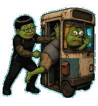

# Jaepe

Jaepe is a fan-made animated pet for Codex: a green frog caricature with a blunt black bowl cut, round glasses, a fitted black shirt, and full tattoo sleeves.


## Gag animation loops — v4

| Actual event | Codex state | Jaepe animation |
| --- | --- | --- |
| First introduction | `waving` | Fake prosecutor<br> |
| Mouse hover | `jumping` | Closed-fist noogie<br> |
| Active work | `running` | Springy barrel stuffing<br> |
| Needs input | `waiting` | Hospital captive<br> |
| Finished / unread output | `review` | Bus-apartment delivery<br> |
| Drag right | `running-right` | Apartment-cashbox getaway<br> |
| Drag left | `running-left` | Mirrored getaway<br> |
| Failed / error | `failed` | Previous hospital loop retained pending replacement<br> |

The requested new failed scene could not be generated, so its existing row remains unchanged. Idle, neutral and all sixteen gaze directions are preserved exactly. The new loops emphasize anticipation, squash/rebound, facial reactions, and a held completion reveal.

The first-introduction event is normally shown only once per pet ID. The app owns the frame counts, timing and triggers; it does not randomly select multiple clips per event.

### Bonus clip

The original transcript-tearing animation remains available outside the native state slots:


## Install

Clone or download this repository, then copy the installable package into the local Codex pets directory:

```sh
mkdir -p ~/.codex/pets/jaepe
cp pet.json spritesheet.webp ~/.codex/pets/jaepe/
```

In Codex, open **Settings → Pets**, choose **Refresh**, select **Jaepe**, and wake the pet. You can also use `/pet`. See the [Codex Pets documentation](https://learn.chatgpt.com/docs/pets).

## Pet contract

- Codex pet ID: `jaepe`
- Sprite contract: v2
- Atlas: 1536 × 2288 WebP
- Grid: 8 × 11 cells at 192 × 208 pixels
- Animation: nine standard state rows, plus 16 clockwise look directions; six unique new/refreshed gag loops with matching left/right getaway frames
- Checksums: [SHA256SUMS](SHA256SUMS)

The complete animation and gaze checks are available in [the contact sheet](docs/contact-sheet.png) and [the direction sheet](docs/direction-sheet.png).

## Fan-art notice

This is independently generated fan art inspired by Pepe-style internet frog imagery and likeness cues associated with South Korean public figure Lee Jae-myung. Its invented cartoon actions draw on political satire, allegations, and memes; they are not assertions that the depicted events actually occurred. It is not affiliated with or endorsed by Lee Jae-myung, any Pepe rights holder, OpenAI, or Codex. See [NOTICE.md](NOTICE.md).
