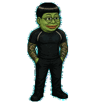

# Jaepe

Jaepe is a fan-made animated pet for Codex: a green frog caricature with a blunt black bowl cut, round glasses, a fitted black shirt, and full tattoo sleeves.



## Install

Clone or download this repository, then copy the installable package into the local Codex pets directory:

```sh
mkdir -p ~/.codex/pets/jaepe
cp pet.json spritesheet.webp ~/.codex/pets/jaepe/
```

In Codex, open **Settings → Pets**, choose **Refresh**, select **Jaepe**, and wake the pet. You can also use `/pet`. See the [Codex Pets documentation](https://learn.chatgpt.com/docs/pets).

## Pet contract

- Codex pet ID: `jaepe`
- Sprite contract: v2
- Atlas: 1536 × 2288 WebP
- Grid: 8 × 11 cells at 192 × 208 pixels
- Animation: nine standard state rows plus 16 clockwise look directions
- SHA-256: `67f4c3d677e58b8dd99fafaadf0dd46d7ca17fa481c831ea26fa07110dac888f`

The complete animation and gaze checks are available in [the contact sheet](docs/contact-sheet.png) and [the direction sheet](docs/direction-sheet.png).

## Fan-art notice

This is independently generated fan art inspired by Pepe-style internet frog imagery and likeness cues associated with South Korean public figure Lee Jae-myung. It is not affiliated with or endorsed by Lee Jae-myung, any Pepe rights holder, OpenAI, or Codex. See [NOTICE.md](NOTICE.md).
